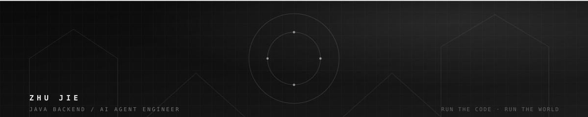
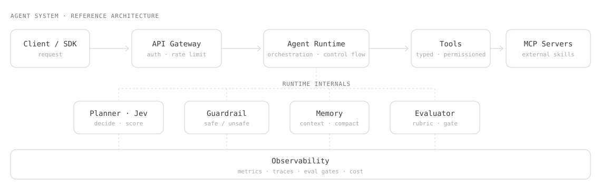

# Jerry Zhu

  

Building reliable backend systems 
and production-ready AI Agents.

**Java · Spring Boot · Redis · RocketMQ** 
**Spring AI · RAG · MCP · Agent**

[Projects](#featured-projects) · [Repositories](https://github.com/zhu1j?tab=repositories) · [Stars](https://github.com/zhu1j?tab=stars)

---

## What I do

I build production-minded backend systems and the agent infrastructure that runs on top of them. I care about correctness under load, clear boundaries, and systems that stay observable long after launch.

- **Backend & systems** — JVM, high concurrency, I/O, messaging (RocketMQ), caching (Redis).
- **AI agents** — Spring AI, RAG, MCP, and agent runtimes — shipped, not just read about.
- **Judgment** — restraint over novelty: one agent until many is justified; measure before scaling.

## How I build an agent system

From the edge in: a typed **Client / SDK** reaches the **API Gateway** (auth, rate limits), which hands off to the **Agent Runtime**. That core is where the real work happens — a **Planner (Jev)** that decides and scores, a **Guardrail** that judges before any side effect, **Memory** that compacts context, and an **Evaluator** that gates releases. **Tools** and **MCP servers** are the only ways out, and every hop is measured by **Observability**.

## Featured projects

#### `JevAgentRuntime` · Java
A Jev-driven enterprise agent runtime / gateway: single-agent orchestration with guardrails, memory, evaluation and observability baked in.

`9 modules` · `69 source files` · `Spring Boot 3.4`

#### `git-subbridge` · TypeScript
A customized Git plugin for Obsidian that solves the nested sub-repository upload problem — the gap the built-in sync never covered.

`Obsidian plugin` · `MIT`

#### `starscope` · JavaScript
Turns your GitHub stars into a personal technical constellation.

`Visualization` · `MIT`

Still building — one commit at a time.

